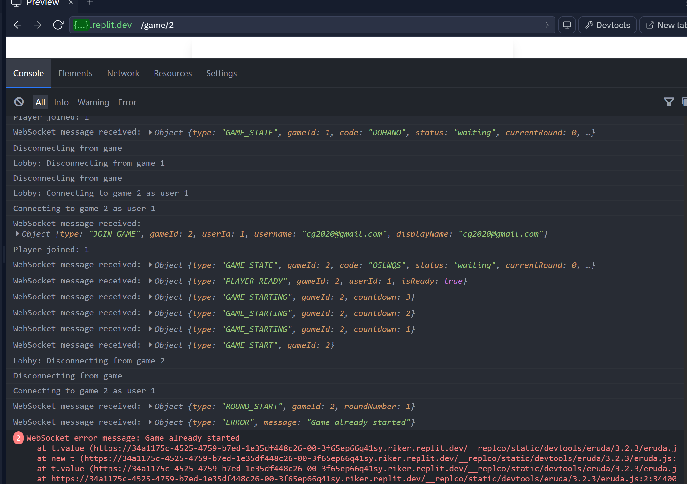

# Time Auction

A real-time multiplayer strategy game featuring a dynamic time-based bidding system with enhanced interactive gameplay mechanics.



## Description

Time Auction is a strategic multiplayer game where players compete to win tokens by bidding their time. The player who holds down the bidding button for the longest time without depleting their time bank wins each round and earns a token. The game tests your nerve and strategy in a unique real-time competition.

### Key Features

- **Time-Based Bidding**: Use your limited time bank strategically to win rounds
- **Multiplayer Support**: Compete against friends in real-time
- **Bot Players**: Play against AI opponents with different psychological profiles
- **Token Collection**: Earn tokens by winning rounds
- **Real-Time Updates**: See opponent actions as they happen
- **Responsive Design**: Play on any device with a web browser

## Getting Started

### Prerequisites

- Node.js (v14 or higher)
- npm (v7 or higher)

### Installation

1. Clone the repository:
   ```bash
   git clone https://github.com/yourusername/time-auction.git
   cd time-auction
   ```

2. Install dependencies:
   ```bash
   npm install
   ```

3. Start the development server:
   ```bash
   npm run dev
   ```

4. Open your browser and navigate to:
   ```
   http://localhost:5000
   ```

## Game Rules

1. **Starting a Game**:
   - Create a new game by setting the number of rounds and time bank
   - Share the game code with friends or add AI opponents
   - Game starts when all players are ready

2. **During a Round**:
   - Hold down the buzzer button to bid time
   - Your time bank decreases while holding
   - The player who holds longest wins the round
   - Releasing the buzzer locks in your bid

3. **Winning the Game**:
   - Earn 1 token for each round you win
   - The player with the most tokens at the end wins
   - In case of a tie, remaining time bank is the tiebreaker

## Documentation

For more detailed information about the project:

- [Architecture Documentation](docs/ARCHITECTURE.md) - Detailed explanation of the system components and data flow
- [Development Guide](docs/README.md) - Guide for developers on how to work with the codebase

## License

This project is licensed under the MIT License.